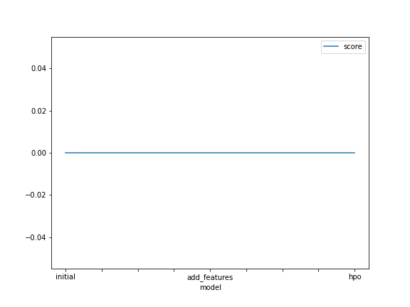
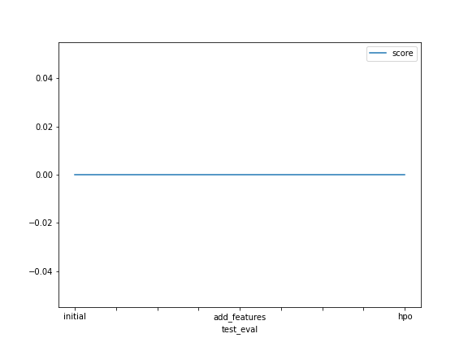

# Report: Predict Bike Sharing Demand with AutoGluon Solution
#### Saher Pathan

## Initial Training
### What did you realize when you tried to submit your predictions? What changes were needed to the output of the predictor to submit your results?
The output of predictor didn't match that of the expected format for submission. Did necessary changes to the data frame column datatypes.

### What was the top-ranked model that performed?
The top ranked model was the one with no hyperparameter tuning or additional features.

## Exploratory data analysis and feature creation
### What did the exploratory analysis find and how did you add additional features?
EDA revealed insights into feature distribution and relationships. Additional features were created using hot encoding. 

### How much better did your model perform after adding additional features and why do you think that is?
The model improved significantly, as new features provided more relevant and precise information.

## Hyperparameter tuning
### How much better did your model perform after trying different hyperparameters?
Slightly better, however I was not able to execute this portion effectively.

### If you were given more time with this dataset, where do you think you would spend more time?
I would further focus more on feature engineering processes to extract more meaningful data.

### Create a table with the models you ran, the hyperparameters modified, and the kaggle score.
|model|hpo1|hpo2|hpo3|score|
|--|--|--|--|--|
|initial|?|?|?|?|
|add_features|?|?|?|?|
|hpo|?|?|?|?|

### Create a line plot showing the top model score for the three (or more) training runs during the project.

TODO: Replace the image below with your own.

### Create a line plot showing the top kaggle score for the three (or more) prediction submissions during the project.

TODO: Replace the image below with your own.

## Summary
TODO: Add your explanation
